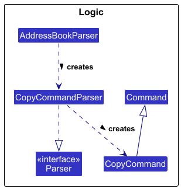
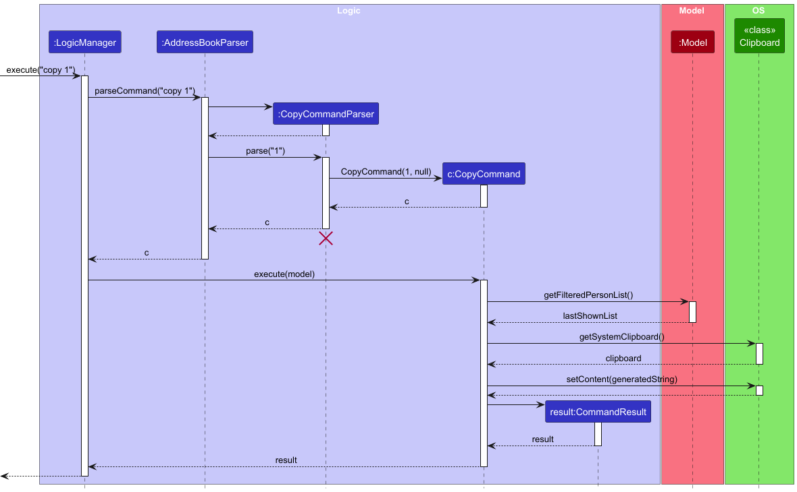
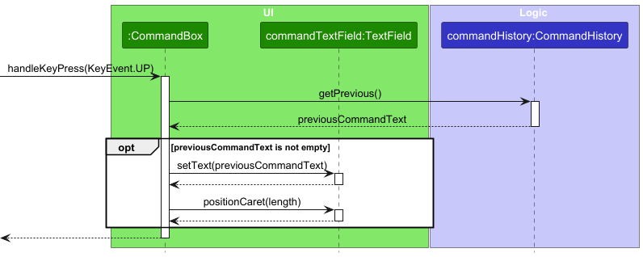

# Harmony Developer Guide

<!-- * Table of Contents -->
<page-nav-print />

--------------------------------------------------------------------------------------------------------------------

## **Setting up, getting started**

Refer to the guide [_Setting up and getting started_](SettingUp.md).

--------------------------------------------------------------------------------------------------------------------

## **Design**

### Architecture

<puml src="diagrams/ArchitectureDiagram.puml" width="280" />

The ***Architecture Diagram*** given above explains the high-level design of the App.

Given below is a quick overview of main components and how they interact with each other.

**Main components of the architecture**

**`Main`** (consisting of classes [`Main`](https://github.com/se-edu/addressbook-level3/tree/master/src/main/java/seedu/address/Main.java) and [`MainApp`](https://github.com/se-edu/addressbook-level3/tree/master/src/main/java/seedu/address/MainApp.java)) is in charge of the app launch and shut down.
* At app launch, it initializes the other components in the correct sequence, and connects them up with each other.
* At shut down, it shuts down the other components and invokes cleanup methods where necessary.

The bulk of the app's work is done by the following four components:

* [**`UI`**](#ui-component): The UI of the App.
* [**`Logic`**](#logic-component): The command executor.
* [**`Model`**](#model-component): Holds the data of the App in memory.
* [**`Storage`**](#storage-component): Reads data from, and writes data to, the hard disk.

[**`Commons`**](#common-classes) represents a collection of classes used by multiple other components.

**How the architecture components interact with each other**

The *Sequence Diagram* below shows how the components interact with each other for the scenario where the user issues the command `contact delete 1`.
<puml src="diagrams/ArchitectureSequenceDiagram.puml" width="574" />

Each of the four main components (also shown in the diagram above),

* defines its *API* in an `interface` with the same name as the Component.
* implements its functionality using a concrete `{Component Name}Manager` class (which follows the corresponding API `interface` mentioned in the previous point.

For example, the `Logic` component defines its API in the `Logic.java` interface and implements its functionality using the `LogicManager.java` class which follows the `Logic` interface. Other components interact with a given component through its interface rather than the concrete class (reason: to prevent outside component's being coupled to the implementation of a component), as illustrated in the (partial) class diagram below.

<puml src="diagrams/ComponentManagers.puml" width="300" />

The sections below give more details of each component.

### UI component

The **API** of this component is specified in [`Ui.java`](https://github.com/se-edu/addressbook-level3/tree/master/src/main/java/seedu/address/ui/Ui.java)

<puml src="diagrams/UiClassDiagram.puml" alt="Structure of the UI Component"/>

The UI consists of a `MainWindow` that is made up of parts e.g.`CommandBox`, `ResultDisplay`, `PersonListPanel`, `StatusBarFooter`, `ViewPanel` etc. All these, including the `MainWindow`, inherit from the abstract `UiPart` class which captures the commonalities between classes that represent parts of the visible GUI.

The `UI` component uses the JavaFx UI framework. The layout of these UI parts are defined in matching `.fxml` files that are in the `src/main/resources/view` folder. For example, the layout of the [`MainWindow`](https://github.com/se-edu/addressbook-level3/tree/master/src/main/java/seedu/address/ui/MainWindow.java) is specified in [`MainWindow.fxml`](https://github.com/se-edu/addressbook-level3/tree/master/src/main/resources/view/MainWindow.fxml)

The `UI` component,

* executes user commands using the `Logic` component.
* listens for changes to `Model` data so that the UI can be updated with the modified data.
* keeps a reference to the `Logic` component, because the `UI` relies on the `Logic` to execute commands.
* depends on some classes in the `Model` component, as it displays `Person` object residing in the `Model`.

### Logic component

**API** : [`Logic.java`](https://github.com/se-edu/addressbook-level3/tree/master/src/main/java/seedu/address/logic/Logic.java)

Here's a (partial) class diagram of the `Logic` component:

<puml src="diagrams/LogicClassDiagram.puml" width="550"/>

The sequence diagram below illustrates the interactions within the `Logic` component, taking `execute("contact delete 1")` API call as an example.

<puml src="diagrams/DeleteSequenceDiagram.puml" alt="Interactions Inside the Logic Component for the `contact delete 1` Command" />

<box type="info" seamless>

**Note:** The lifeline for `DeleteContactCommandParser` should end at the destroy marker (X) but due to a limitation of PlantUML, the lifeline continues till the end of diagram.
</box>

How the `Logic` component works:

How the `Logic` component works:

1. When `Logic` is called upon to execute a command, it is passed to an `AddressBookParser` object which in turn creates a parser that matches the command (e.g., `DeleteContactCommandParser`) and uses it to parse the command.
2. This results in a `Command` object (more precisely, an object of one of its subclasses e.g., `DeleteContactCommand`) which is executed by the `LogicManager`.
3. The command can communicate with the `Model` when it is executed (e.g. to delete a person). 
   Note that although this is shown as a single step in the diagram above (for simplicity), in the code it can take several interactions (between the command object and the `Model`) to achieve. 
4. The result of the command execution is encapsulated as a `CommandResult` object which is returned back from `Logic`. 
5. If the command implements the `UndoableCommand` interface, `LogicManager` pushes it onto the `commandHistory` stack so it can be reversed by a subsequent `undo` command.

Here are the other classes in `Logic` (omitted from the class diagram above) that are used for parsing a user command:

<puml src="diagrams/ParserClasses.puml" width="600"/>

How the parsing works:
* When called upon to parse a user command, the `AddressBookParser` class creates an `XYZCommandParser` (`XYZ` is a placeholder for the specific command name e.g., `AddCommandParser`) which uses the other classes shown above to parse the user command and create a `XYZCommand` object (e.g., `AddCommand`) which the `AddressBookParser` returns back as a `Command` object.
* All `XYZCommandParser` classes (e.g., `AddCommandParser`, `DeleteContactCommandParser`, ...) inherit from the `Parser` interface so that they can be treated similarly where possible e.g., during testing.
### Model component
**API** : [`Model.java`](https://github.com/se-edu/addressbook-level3/tree/master/src/main/java/seedu/address/model/Model.java)

<puml src="diagrams/ModelClassDiagram.puml" width="450" />

The `Model` component,

* stores the address book data i.e., all `Person` objects (which are contained in a `UniquePersonList` object).
* stores the currently 'selected' `Person` objects (e.g., results of a search query) as a separate _filtered_ list which is exposed to outsiders as an unmodifiable `ObservableList<Person>` that can be 'observed' e.g. the UI can be bound to this list so that the UI automatically updates when the data in the list change.
* stores a `UserPref` object that represents the user’s preferences. This is exposed to the outside as a `ReadOnlyUserPref` objects.
* does not depend on any of the other three components (as the `Model` represents data entities of the domain, they should make sense on their own without depending on other components)

<box type="info" seamless>

**Note:** An alternative (arguably, a more OOP) model is given below. It has a `Tag` list in the `AddressBook`, which `Person` references. This allows `AddressBook` to only require one `Tag` object per unique tag, instead of each `Person` needing their own `Tag` objects. 

<puml src="diagrams/BetterModelClassDiagram.puml" width="450" />

</box>

### Storage component

**API** : [`Storage.java`](https://github.com/se-edu/addressbook-level3/tree/master/src/main/java/seedu/address/storage/Storage.java)

<puml src="diagrams/StorageClassDiagram.puml" width="550" />

The `Storage` component,
* can save both address book data and user preference data in JSON format, and read them back into corresponding objects.
* inherits from both `AddressBookStorage` and `UserPrefStorage`, which means it can be treated as either one (if only the functionality of only one is needed).
* depends on some classes in the `Model` component (because the `Storage` component's job is to save/retrieve objects that belong to the `Model`)

### Common classes

Classes used by multiple components are in the `seedu.address.commons` package.

--------------------------------------------------------------------------------------------------------------------

## **Implementation**

This section describes some noteworthy details on how certain features are implemented.

### Copy Command Feature
The `copy` command allows users to quickly serialize a specific contact's complex profile (including their name, games, and aliases) into a perfectly formatted, executable CLI string (e.g., `contact add n/John Doe g/Valorant...`) and saves it directly to their operating system's clipboard.

#### Architecture and Execution
To avoid cluttering the main logic architecture diagram, the structural relationship of the `CopyCommand` is shown in the feature-specific class diagram below.

The command execution heavily relies on the `Logic` and `Model` components to retrieve the target contact, format the string, and then interfaces with the external OS `Clipboard`.

Step-by-step execution:
1. The user launches the application and inputs `copy 1` into the `CommandBox`.
2. `LogicManager` passes the input to `AddressBookParser`, which maps the command word to the `CopyCommandParser`.
3. `CopyCommandParser` parses the index, creates a `CopyCommand` object, and returns it.
4. `LogicManager` calls `CopyCommand#execute(model)`.
5. The command fetches the target `Person` from the `Model` using the provided index.
6. The command formats the person's attributes into a valid CLI string.
7. The command fetches the system `Clipboard` and sets its content to the formatted string.
8. A `CommandResult` is returned to indicate success.

The following sequence diagram illustrates this interaction:

#### Design Considerations:
* **Alternative 1 (Current):** Interface directly with the `Clipboard` within the `CopyCommand` execution logic, but use a mock/stub clipboard for testing.
    * **Pros:** Keeps the command highly cohesive and straightforward.
    * **Cons:** Requires careful testing setup to ensure CI/CD pipelines (which run in headless Linux environments without physical clipboards) do not crash with `IllegalStateException`.
* **Alternative 2:** Have the `CopyCommand` return the generated string inside the `CommandResult`, and force the `MainWindow` (UI) to push it to the clipboard.
    * **Pros:** Avoids headless testing issues entirely since the Logic component never touches the OS.
    * **Cons:** Violates the separation of concerns. The UI should merely display results, not execute system-level operations meant to be triggered by a specific command.

---

### Command History Navigation (Up/Down Arrows)
To improve the Quality of Life (QoL) of the CLI interface, users can navigate their session's command history using the Up and Down arrow keys.

#### Architecture and Execution
A naive implementation would store the history state directly inside the UI's `CommandBox`. However, UI components are notoriously difficult to test automatically without relying on heavy frameworks like TestFX.

To maintain strict adherence to testability, the state tracking logic is completely decoupled into a standalone `CommandHistory` class within the `Logic` component.

Step-by-step execution:
1. The user presses the Up arrow key in the text field.
2. The `CommandBox` triggers the `handleKeyPress(KeyEvent)` method.
3. The `CommandBox` queries the `CommandHistory` logic class via `getPrevious()`.
4. If a previous command exists, the text field is updated, and the cursor (`caret`) is forcefully positioned at the end of the loaded string.

The following sequence diagram proves the UI-Logic decoupling during this interaction:

#### Design Considerations:
* **UI vs Logic State Tracking:** By placing `CommandHistory.java` inside the `logic` package, we achieve 100% test coverage of the pointer math (including floor and ceiling boundary checks) using standard, lightning-fast headless JUnit tests, entirely bypassing the JavaFX Toolkit lifecycle.

### \[Proposed\] Undo/redo feature
### Editing a contact's name feature

#### Implementation

The `contact edit` command allows users to rename an existing contact while preserving all associated games and aliases. It is implemented via `EditContactCommand`, parsed by `EditContactCommandParser`, and routed through `ContactCommandParser`.

**Parsing flow:**
1. `AddressBookParser` receives `"contact edit 1 e/Jan"` (or `"contact edit n/Janelle e/Jan"`) and dispatches to `ContactCommandParser`.
2. `ContactCommandParser` splits on the first token (`"edit"`) and delegates the remaining args to `EditContactCommandParser`.
3. `EditContactCommandParser` tokenizes using `PREFIX_NAME` (`n/`) and `PREFIX_NEW_NAME` (`e/`). It then determines the target via `ParserUtil.verifyIndexOrNamePresent` — either an index from the preamble, a name from `n/`, or `0` for the user profile — and returns an `EditContactCommand(targetIndex, targetName, newName, useUserProfile)`.

**Execution flow:**
1. `EditContactCommand#execute()` resolves the target `Person`:
   * If `useUserProfile` is true, retrieves the user profile via `model.getUserProfile()`.
   * If `targetIndex` is set, retrieves the person at that index from the filtered list.
   * If `targetName` is set, searches `model.getFilteredPersonList()` for a case-insensitive name match.
2. If not found, a `CommandException` with `MESSAGE_PERSON_NOT_FOUND` is thrown.
3. A new `Person` is created with `newName` and the original person's `games`, and `isUserProfile` flag.
4. If the new name already belongs to a different person, a `CommandException` with `MESSAGE_DUPLICATE_PERSON` is thrown.
5. `model.setPerson()` replaces the old entry, and the filtered list is reset to show all persons.
6. A `CommandResult` is returned, displaying the updated contact.

**Design considerations:**

* **Immutable `Person` model** — `Person` objects are immutable; editing creates a new `Person` rather than mutating the existing one. This keeps the model simple and consistent with the rest of the codebase.
* **Index and name-based lookup** — The command supports both index and name identification, consistent with `alias edit` and `view`. A single constructor `(Index, Name, Name, boolean)` is used with the unused field passed as `null`, matching the pattern used by `EditAliasCommand`.
* **Games and aliases preserved** — The new `Person` is constructed with the original person's `games` map, so all associated data is retained after a rename.

### Undo feature

#### Implementation

The undo mechanism is implemented using a **command history stack** managed by `LogicManager`, together with an `UndoableCommand` interface that undoable commands implement.

**Key classes involved:**

* `UndoableCommand` (interface) — declares `void undo(Model model)`, which each undoable command implements to reverse its own effect.
* `UndoCommand` — pops the most recent command from the history stack and calls its `undo()` method.
* `LogicManager` — owns the history stack (`Deque<UndoableCommand> commandHistory`) and pushes commands onto it after successful execution.

**How the history stack is maintained:**

After a command executes successfully, `LogicManager` checks whether it implements `UndoableCommand`. If it does, the command is pushed onto the `commandHistory` deque (used as a LIFO stack). Read-only commands (e.g. `list`, `find`) do not implement `UndoableCommand` and are never added to history.

<box type="info" seamless>

**Note:** `UndoCommand` itself is not pushed to history — it is created directly in `LogicManager` when the keyword `undo` is detected, bypassing the parser.

</box>

**How each command reverses itself (per-command state capture):**

Rather than saving a full snapshot of the address book after each command, each undoable command captures only what it needs:

| Command | State captured | Undo action |
|---|---|---|
| `AddContactCommand` | The `Person` added | `model.deletePerson(toAdd)` |
| `DeleteContactCommand` | The `Person` deleted (set after confirmation) | `model.addPerson(deletedPerson)` |
| `ClearCommand` | Full `AddressBook` snapshot (before clear) | `model.setAddressBook(previousAddressBook)` |
| `AddGameCommand` | `personBeforeEdit`, `personAfterEdit` | `model.setPerson(personAfterEdit, personBeforeEdit)` |
| `DeleteGameCommand` | `personBeforeEdit`, `personAfterEdit` | `model.setPerson(personAfterEdit, personBeforeEdit)` |
| `AddAliasCommand` | `personBeforeEdit`, `personAfterEdit` | `model.setPerson(personAfterEdit, personBeforeEdit)` |
| `DeleteAliasCommand` | `personBeforeEdit`, `personAfterEdit` | `model.setPerson(personAfterEdit, personBeforeEdit)` |
| `EditContactCommand` | `personBeforeEdit`, `personAfterEdit` | `model.setPerson(personAfterEdit, personBeforeEdit)` |
| `EditAliasCommand` | `personBeforeEdit`, `personAfterEdit` | `model.setPerson(personAfterEdit, personBeforeEdit)` |

**Special case — delete confirmation:**

`DeleteContactCommand` requires the user to confirm before the deletion is committed. The command is only pushed to `commandHistory` after the user confirms with `y`/`yes`. Cancelling the deletion means nothing is added to history.

Given below is an example usage scenario showing how the undo mechanism behaves.

Step 1. The user executes `contact add n/David` to add a new contact. `AddContactCommand` executes, stores the added `Person`, and is pushed onto `commandHistory`.

Step 2. The user executes `game add n/David g/Chess` to add a game. `AddGameCommand` executes, stores `personBeforeEdit` and `personAfterEdit`, and is pushed onto `commandHistory`.

Step 3. The user executes `undo`. `LogicManager` creates `UndoCommand(commandHistory)`. It pops `AddGameCommand` from the stack and calls its `undo()`, which calls `model.setPerson(personAfterEdit, personBeforeEdit)`, restoring David's original state.

Step 4. The user executes `undo` again. `UndoCommand` pops `AddContactCommand` and calls its `undo()`, which calls `model.deletePerson(toAdd)`, removing David entirely.

Step 5. The user executes `undo` again. The history stack is empty, so `UndoCommand` throws a `CommandException` with the message `"Error: Nothing to undo."`

The following sequence diagram shows how an undo operation flows through the `Logic` component:

<puml src="diagrams/UndoSequenceDiagram.puml" alt="UndoSequenceDiagram" />

The following activity diagram summarizes what happens when a user executes a new command:

<puml src="diagrams/UndoActivityDiagram.puml" width="250" />

#### Design considerations:

**Aspect: How undo executes:**

* **Current choice:** Per-command state capture — each command stores only the data it needs to reverse itself.
  * Pros: Low memory overhead; no full address book snapshots needed for most commands.
  * Cons: Every new undoable command must correctly implement `undo()`.

* **Alternative:** Save a full address book snapshot after every command (VersionedAddressBook approach).
  * Pros: Simpler to implement per command — no per-command state logic needed.
  * Cons: Higher memory usage, especially with large contact lists.

**Aspect: No redo support:**

Redo is not implemented. Once a command is undone it is removed from the history stack permanently.

--------------------------------------------------------------------------------------------------------------------

### Delete Confirmation Feature
The `contact delete`, `game delete`, and `alias delete` commands require a y/n confirmation from the user before deletion is applied, to prevent accidental data loss.

#### Architecture and Execution
The structural relationship of the delete commands is shown in the class diagram below.

<puml src="diagrams/DeleteCommandClassDiagram.puml" alt="Delete Command Class Diagram" />

All three delete commands implement `ConfirmableDeleteCommand`, which declares `performDeletion()` and `getCancelMessage()`. This gives `LogicManager` a single unified code path for all confirmation handling.

The following sequence diagram illustrates the two-step flow for `contact delete n/Alice` followed by `y`:

<puml src="diagrams/DeleteConfirmSequenceDiagram.puml" alt="Delete Confirmation Sequence Diagram" />

Step-by-step execution:
1. The user inputs `contact delete n/Alice`.
2. `LogicManager` passes the input to `AddressBookParser`, which creates a `DeleteContactCommand`.
3. `LogicManager` calls `DeleteContactCommand#execute(model)`, which finds the target but does **not** delete yet — returns a `CommandResult` with `isAwaitingConfirmation = true`.
4. `LogicManager` stores the command in `pendingConfirmableCommand` and shows the confirmation prompt.
5. The user inputs `y` — `LogicManager#handleDeleteConfirmation()` calls `performDeletion()` on the command, conditionally pushes it to `commandHistory` if it implements `UndoableCommand`, and saves the address book.
6. If the user inputs `n` or any other input, `getCancelMessage()` is returned and the model is unchanged.

#### Design Considerations:
* **`ConfirmableDeleteCommand` is decoupled from `UndoableCommand`** — allows future commands to require confirmation without needing to support undo. All three current delete commands implement both interfaces explicitly.
* **Alternative:** Have `LogicManager` perform the deletion directly (e.g. `model.deletePerson()`) after confirmation, without a `performDeletion()` method on the command.
    * **Pros:** Simpler — no extra interface or method needed.
    * **Cons:** `LogicManager` must know the internals of each delete command (e.g. which game or alias to remove), violating separation of concerns and requiring `instanceof` checks for each command type.

--------------------------------------------------------------------------------------------------------------------

## **Documentation, logging, testing, configuration, dev-ops**

* [Documentation guide](Documentation.md)
* [Testing guide](Testing.md)
* [Logging guide](Logging.md)
* [Configuration guide](Configuration.md)
* [DevOps guide](DevOps.md)

--------------------------------------------------------------------------------------------------------------------

## **Appendix: Requirements**

### Product scope

**Target user profile**:

* has a need to manage a significant number of contacts
* prefer desktop apps over other types
* can type fast
* prefers typing to mouse interactions
* is reasonably comfortable using CLI apps
* plays games on with a friends online

**Value proposition**: It allows the user to have quick access to the different aliases that their contacts may be using.

### User stories

Priorities: High (must have) - `* * *`, Medium (nice to have) - `* *`, Low (unlikely to have) - `*`

| Priority | As a …​    | I want to …​                       | So that I can…​                                              |
|----------|------------|------------------------------------|--------------------------------------------------------------|
| `* * *`  | user       | add a new contact                  |                                                              |
| `* * *`  | user       | delete a contact                   | remove contacts that I no longer need                        |
| `* * *`  | user       | edit a contact's name              | modify a contact without removing associated alias and games |
| `* * *`  | user       | display all contacts               |                                                              |
| `* *`    | user       | add an alias to a contact          | keep track of alternate usernames used by the contact        |
| `* *`    | user       | delete an alias from a contact     | remove aliases that the contact is no longer using           |
| `* *`    | user       | add a game that the contact plays  | keep track of which games the contact plays                  |
| `* *`    | user       | delete a game that a contact plays | remove games that the contact no longer plays                |
| `*`      | new user   | see usage instructions             | refer to command syntax when I forget how to use the app     | \

### Use cases

(For all use cases below, the **System** is `Harmony` and the **Actor** is the `user`, unless specified otherwise)

**Use case: UC1 - Add a contact**

**MSS**

1.  User requests to add a contact.
2.  System adds contact to User Contact list.
3.  System displays updated Contact list.

    Use case ends.

**Extensions**

* 1a. Contact already exists.

    * 1a1. System displays error message indicating duplicate Contact name.

      Use case ends.

**Use Case: UC2 - Delete contact**

**Precondition**
* The list is not empty.

**MSS**
1.  User requests to delete a specific contact by name.
2.  System identifies the matching contact.
3.  System removes the contact and its associated aliases and games.
4.  System confirms deletion.

    Use case ends.

**Extensions**

* 2a. No contact is found with matching name.
  * 2a1. System informs user that no matching user is found.

    Use case ends.

**Use case: UC3 -  Add an alias**

**MSS**
1. User request to add an alias to a contact by specifying the name and new alias to be added.
2. System identifies the matching contact.
3. System add new alias to the contact.
4. System confirms changes made.

   Use case ends.

**Extensions**

* 1a. System detects errors in the entered field..
  * 1a1. System notify user of the errors in the invalid entry.
  * 1a2. User re-enter the field.

     Steps 1a1-1a2 are repeated until the data entered are correct.

     Use case resumes from step 2.

* 1b. Contact not in database.
  * 1b1. System notify user of the invalid contact.

    Use case ends.

**Use Case: UC4 - Edit contact’s name**

**Precondition**
* Contact exists in user’s address book.

**MSS**
1. User requests to edit contact name.
2. System shows the requested contact’s detail.
3. User enters new name.
4. System outputs contact updated message.

**Extensions**
* 1a. User tries to edit a non-existent contact.
  * 1a1. System outputs: Contact does not exist.

    Use case ends.

* 3a. User inputs name with violations .
  * 3a1. System outputs: invalid names message.

    Use case ends.

**Use Case: UC5 - Listing all User’s contacts**

**MSS**
1. User requests to list all contacts.
2. System displays all contacts.

   Use case ends.

**Extensions**
* 1a. User does not have any Contacts in list.
  * 1a1. “No contacts in address book” messages pop up.

    Use case ends.

**Use Case: UC6 - Delete an alias**

**Precondition**
* The contact and alias exist.

**MSS**
1. User requests to remove a specific alias from a contact.
2. System identifies the contact and specific alias.
3. System removes the alias from the record.
4. System confirms the removal.

   Use case ends.

**Use Case: UC7 - Add a game to Contact**

**Precondition**
* Harmony is running and specified contact must already exist in the database.

**MSS**
1. User requests to add a game that a specific contact plays.
2. System adds the game to the contact’s profile.
3. System displays the contact’s detail panel to with the games added.

   Use case ends.

**Extensions**
* 2a. The game is a duplicate (already exists for that specific contact)  .
  * 2a1. System informs user that the game already exists for that contact.

    Use case ends.

* 2b. The game name is missing or exceeds 200 characters.
  * 2b1. System informs the user of the invalid game field.

    Use case ends.

* *a. At any time, the user chooses to cancel the operation
  * *a1. System stops the process

    Use case ends

**Use Case: UC8 - Delete a game from Contact**

**Precondition**
* The game to be deleted exists in the User’s contact list.

**MSS**
1. User requests to remove a specific game from a contact.
2. System removes the game from the contact.
3. System displays the contact’s detail panel.

   Use case ends.

### Non-Functional Requirements

1.   Initial startup should take no longer than 2s.
2.   A user with above average typing speed for regular English text (i.e. not code, not system admin commands) should be able to accomplish most of the tasks faster using commands than using the mouse.

### Glossary

* **Alias**: Alternate usernames used by the user

--------------------------------------------------------------------------------------------------------------------

## **Appendix: Instructions for manual testing**

Given below are instructions to test the app manually.

<box type="info" seamless>

**Note:** These instructions only provide a starting point for testers to work on;
testers are expected to do more *exploratory* testing.

</box>

### Launch and shutdown

1. Initial launch

   1. Download the jar file and copy into an empty folder

   2. Double-click the jar file Expected: Shows the GUI with a placeholder User Profile. The window size may not be optimum.

2. Saving window preferences

   1. Resize the window to an optimum size. Move the window to a different location. Close the window.

   2. Re-launch the app by double-clicking the jar file. 
       Expected: The most recent window size and location is retained.

### Deleting a person

1. Deleting a person while all persons are being shown

   1. Prerequisites: List all persons using the `list` command. Multiple persons in the list.

   2. Test case: `contact delete 1` 
      Expected: First contact is deleted from the list. Details of the deleted contact shown in the status message. Timestamp in the status bar is updated.

   3. Test case: `contact delete 0` 
      Expected: No person is deleted. Error details shown in the status message. Status bar remains the same.

   4. Other incorrect delete commands to try: `contact delete`, `contact delete x`, `...` (where x is larger than the list size) 
      Expected: Similar to previous.

### Editing a contact's name

1. Renaming a contact while all persons are shown

   1. Prerequisites: List all persons using the `list` command. At least one contact in the list (e.g. `Alex Yeoh` at index 1).

   2. Test case: `contact edit n/Alex Yeoh e/Alex` 
      Expected: Contact is renamed. Success message `Contact updated: Alex Yeoh → Alex` shown.

   3. Test case: `contact edit 1 e/Alex` 
      Expected: First contact is renamed. Success message `Contact updated: [original name] → Alex` shown.

   4. Test case: `contact edit n/NonExistent e/NewName` 
      Expected: No contact is renamed. Error message `Error: Name not found` shown.

   5. Test case: `contact edit 999 e/NewName` (index out of bounds) 
      Expected: No contact is renamed. Invalid index error shown.

   6. Test case: `contact edit 1 n/Alex Yeoh e/NewName` (both index and name provided) 
      Expected: No contact is renamed. Error message `Please provide either an index OR a name, not both.` shown.

   7. Test case: `contact edit n/Alex Yeoh e/Bernice Yu` (where `Bernice Yu` already exists) 
      Expected: No contact is renamed. Error message `Error: A contact with that name already exists` shown.

   8. Test case: `contact edit n/Alex Yeoh` (missing `e/` prefix) 
      Expected: No contact is renamed. Invalid command format error shown.

--------------------------------------------------------------------------------------------------------------------

## **Appendix: Planned Enhancement**

Team size: 5
* <b>Make the command result window to scale with text.</b> The current command result window is too small to fully view the result of the command. This might prevent users from viewing the full result without breaking from "full CLI"
* <b>Make the Contact List panel scroll without mouse input.</b> The current Contact List panel can only be manipulated with a mouse (barring the find command to reduce the size of the list) once again breaking from "full CLI"
* <b>Modify the scaling of components when application window is resized.</b> Currently, resizing the application window makes the command result wider, and the bottom view panels the same scaling, which does not translate well for the user experience on larger screens.