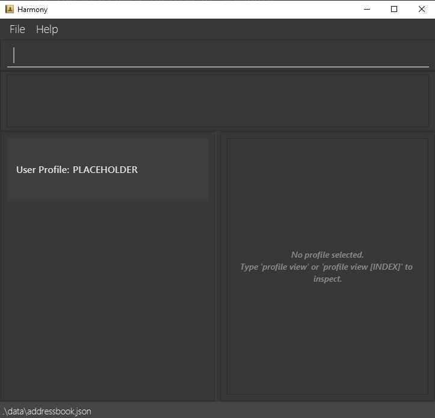

# Harmony User Guide

Harmony is a **desktop app built for gamers** 🎮 who want to **manage their gaming contacts and aliases in one place**, optimized for use via a **Command Line Interface (CLI)** while still having the benefits of a Graphical User Interface (GUI). Whether you play across **multiple games or platforms**, Harmony helps you keep track of your friends' **in-game identities** — their usernames, aliases, and the games they play — all **without leaving your keyboard** ⌨️. If you can type fast, Harmony can get you there **faster than any traditional GUI app** 🚀.

<page-nav-print />

--------------------------------------------------------------------------------------------------------------------

## Contents

**Getting Started**
* [Quick start](#quick-start)

**Features**
* [Notes about the command format](#features)
* [Your User Profile](#your-user-profile)

**General**
* [Viewing help: `help`](#viewing-help-help)
* [Listing all contacts: `list`](#listing-all-contacts-list)
* [Undoing the last command: `undo`](#undoing-the-last-command-undo)
* [Clearing all entries: `clear`](#clearing-all-entries-clear)
* [Changing the UI theme: `theme`](#changing-the-ui-theme-theme)
* [Exiting the program: `exit`](#exiting-the-program-exit)

**Contact Management**
* [Adding a contact: `contact add`](#adding-a-contact-contact-add)
* [Viewing a contact's profile: `view`](#viewing-a-contacts-profile-view)
* [Copying a contact: `copy`](#copying-a-contact-copy)
* [Editing a contact's name: `contact edit`](#editing-a-contacts-name-contact-edit)
* [Locating contacts: `find`](#locating-contacts-find)
* [Deleting a contact: `contact delete`](#deleting-a-contact-contact-delete)

**Game Management**
* [Adding a game: `game add`](#adding-a-game-to-a-contact-game-add)
* [Deleting a game: `game delete`](#deleting-a-game-from-a-contact-game-delete)
* [Listing games: `game list`](#listing-games-of-a-contact-game-list)

**Alias Management**
* [Adding an alias: `alias add`](#adding-an-alias-to-a-game-alias-add)
* [Editing an alias: `alias edit`](#editing-an-alias-of-a-game-alias-edit)
* [Deleting an alias: `alias delete`](#deleting-an-alias-from-a-game-alias-delete)

**Data Management**
* [Saving the data](#saving-the-data)
* [Editing the data file](#editing-the-data-file)

**Reference**
* [FAQ](#faq)
* [Known issues](#known-issues)
* [Command summary](#command-summary)

--------------------------------------------------------------------------------------------------------------------

## Quick start

1. Ensure you have Java `17` installed on your computer. Refer to the [Java installation guide](https://se-education.org/guides/tutorials/javaInstallation.html) for instructions specific to your operating system.

   <box type="info" seamless>

   **Mac users:** Ensure you have the precise JDK version prescribed [here](https://se-education.org/guides/tutorials/javaInstallationMac.html).

   </box>

2. Download the latest `harmony.jar` file from [here](https://github.com/AY2526S2-CS2103T-W09-1/tp/releases).

3. Place `harmony.jar` in an empty folder where the app is allowed to create files. Do not use a write-protected folder, as Harmony needs to save data in the same directory.

4. Open a command terminal and verify you are running Java 17 by running:
   ```
   java -version
   ```
   Do this even if you have done it before — your OS may have auto-updated the default Java version.

5. Navigate to the folder containing `harmony.jar` and run the app. Select your operating system below:

   <tabs>
     <tab header="Windows">

   Open the **DOS prompt** or **PowerShell** (**not** the WSL terminal) and run:
   ```
   cd path\to\folder
   java -jar "[CS2103-T09-1][Harmony].jar"
   ```

   <box type="info" seamless>

   Replace `path\to\folder` with the actual path to the folder containing `harmony.jar`.<br>
   e.g., `cd C:\Users\John\Downloads\Harmony`

   </box>

     </tab>
     <tab header="Mac">

   Open **Terminal** and run:
   ```
   cd path/to/folder
   java -jar "[CS2103-T09-1][Harmony].jar"
   ```

   <box type="info" seamless>

   Replace `path/to/folder` with the actual path to the folder containing `harmony.jar`.<br>
   e.g., `cd /Users/John/Downloads/Harmony`

   </box>

     </tab>
     <tab header="Linux">

   Open a **terminal** and run:
   ```
   cd path/to/folder
   java -jar "[CS2103-T09-1][Harmony].jar"
   ```

   <box type="info" seamless>

   Replace `path/to/folder` with the actual path to the folder containing `harmony.jar`.<br>
   e.g., `cd /home/john/Downloads/Harmony`

   </box>

   <box type="warning" seamless>

   **Wayland display server:** If the app fails with a `Gdk-CRITICAL` error, run this instead:
   ```
   GDK_BACKEND=x11 java -jar "[CS2103-T09-1][Harmony].jar"
   ```

   </box>

     </tab>
   </tabs>

   <box type="tip" seamless>

   Always launch Harmony using the `java -jar` command rather than double-clicking the file. This ensures the correct Java version is used. We strongly recommend surrounding the filename with double quotes in case special characters in the filename cause the command to break.

   </box>

   A GUI similar to the below should appear in a few seconds.<br>
   

6. Type the command in the command box and press Enter to execute it. e.g. typing **`help`** and pressing Enter will open the help window.<br><br>
   Some example commands you can try:

   * `contact add n/John Doe` : Adds a contact named `John Doe` to Harmony.

   * `game add 1 g/Valorant` : Adds the game `Valorant` to the 1st contact shown.

   * `alias add 1 g/Valorant al/JohnnyV` : Adds the alias `JohnnyV` to the 1st contact's `Valorant` game.

   * `contact edit me e/Benny` : Edits your User Profile to display `Benny` as the name.

   * `view me` : Opens the profile view panel to display your own user profile.

   * `find n/Ben` : Find all contacts with name containing `Ben` such as `Benny`, `Ben` etc.

   * `list` : Lists all contacts.

   * `copy 1` : Copies the exact command needed to recreate the 1st contact to your system clipboard.

   * `theme light` : Switches the application's visual interface to Light Mode.

   * `contact delete n/John Doe` : Deletes the contact named `John Doe` (with confirmation prompt).

   * `clear` : Deletes all contacts.

   * `exit` : Exits the app.

7. Refer to the [Features](#features) below for details of each command.

--------------------------------------------------------------------------------------------------------------------

## Features

### Notes about the command format

<box type="info" seamless>
<br>

* Commands follow the format `CATEGORY ACTION`, where `CATEGORY` is `contact`, `game`, or `alias`, followed by an action such as `add`, `delete`, or `edit`.<br>
  e.g. `contact add`, `game delete`, `alias edit`. Note: `game` does not support `edit` — to rename a game, delete it and add a new one.

* Words in `UPPER_CASE` are the parameters to be supplied by the user.<br>
  e.g. in `contact add n/NAME`, `NAME` is a parameter which can be used as `contact add n/John Doe`.

* Items in square brackets are optional.<br>
  e.g. `find [n/NAME] [g/GAME_NAME] [al/ALIAS]` can be used as `find n/Alice` or `find n/Alice g/Valorant`.

* Items with `…`​ after them can be used multiple times including zero times.<br>
  e.g. in `contact add n/NAME [g/GAME [al/ALIAS]…​]…​`, `[al/ALIAS]…​` means you can specify multiple aliases: `contact add n/Alice g/Valorant al/Ace al/ProGamer`.

* For `game`, `alias`, and target-specific commands, a contact can be targeted by their index (`INDEX`), by name (`n/CONTACT_NAME`), or by the `me` keyword to target your own User Profile.<br>
  e.g. `game add 1 g/Valorant`, `game add n/John Doe g/Valorant`, and `game add me g/Valorant` can all be used to target a contact.

* `INDEX` must be a positive integer and must appear before any prefixed parameters.<br>
  e.g. `game add 1 g/Valorant`, not `game add g/Valorant 1`.

* Prefixed parameters (those using `n/`, `g/`, `al/`, etc.) can be in any order.<br>
  e.g. `contact add n/John Doe g/Minecraft` and `contact add g/Valorant n/John Doe` are both acceptable. Note: Game must exist before alias can be added

* Extraneous parameters for commands that do not take in parameters (such as `help`, `list`, `undo`, `clear` and `exit`) will be ignored.<br>
  e.g. `help 123` will be interpreted as `help`.

* **Whitespace trimming:** Extra spaces immediately following a prefix (e.g., `n/    John`) or trailing at the end of a parameter will be automatically ignored by the system. `contact add n/John` and `contact add n/      John` will result in the exact same contact being added.

* If you are using a PDF version of this document, be careful when copying and pasting commands that span multiple lines as space characters surrounding line-breaks may be omitted when copied over to the application.
  </box>

--------------------------------------------------------------------------------------------------------------------

### Your User Profile

Harmony reserves a special entry called your **User Profile** — it represents you, the user, and is separate from your contact list.

You can interact with your User Profile using the `me` keyword in place of an index or name in any command that supports it. For example:

* `view me` — view your own profile
* `contact edit me e/ProGamer` — rename your profile
* `game add me g/Valorant` — add a game to your profile
* `alias add me g/Valorant al/ProV` — add an alias to a game on your profile
* `contact delete me` — resets the profile to "PLACEHOLDER"
<box type="tip" seamless>

Your User Profile always appears at the top of the contact list. It is not counted in the contact list total displayed after commands like `list` or `find`.

</box>

<box type="tip" seamless>
If the User Profile is not detected during runtime or start up, a PLACEHOLDER will be generated.
</box>

<box type="warning" seamless>
`me` is a special reserved keyword — it is **not** the same as `n/me`. Parameter `n/me` refers to contacts whose name is "me", whereas `me` specifically targets your own User Profile.
</box>

<box type="warning" seamless>
If multiple User Profiles are detected on start up, it will be deemed as a corrupt addressbook.json. This can be remedied by modifying the `data/addressbook.json` to only contain one `"isUserProfile" : true`
</box>

--------------------------------------------------------------------------------------------------------------------
## General

### Viewing help: `help`

Shows a message explaining how to access the help page.


Format: `help`


### Listing all contacts: `list`

Shows a list of all contacts in Harmony.

Format: `list`


### Undoing the last command: `undo`

Reverses the most recently executed undoable command.

Format: `undo`

* Undoable commands include: `contact add`, `contact delete`, `contact edit`, `game add`, `game delete`, `alias add`, `alias edit`, `alias delete`, and `clear`.
* Multiple consecutive `undo` calls will reverse commands in reverse order of execution.
* If there are no commands left to undo, an error message is shown.


### Clearing all entries: `clear`

Clears all contacts from Harmony. Your own user profile is preserved.

Format: `clear`

* A confirmation prompt will appear. Type `y` or `yes` to confirm, or `n` or `no` to cancel.


### Changing the UI theme: `theme`

Changes the visual appearance of the Harmony application.

Format: `theme THEME_NAME`

* Currently supported themes are `dark`, `light`, and an Easter Egg!
* The `dark` theme is the default appearance.
* The application will immediately update its interface to the specified theme.

Examples:
* `theme light`
* `theme dark`


### Exiting the program: `exit`

Exits the program.

Format: `exit`

--------------------------------------------------------------------------------------------------------------------

## Contact Management

<box type="info" seamless>

For commands that specific contact by name, `NAME` must match the contact's full name exactly (case-insensitive).

</box>

### Adding a contact: `contact add`

Adds a contact to Harmony.

Format: `contact add n/NAME [g/GAME [al/ALIAS]…​]…​`

<box type="tip" seamless>

**Tip:** A contact can have any number of games, and aliases (including 0). Aliases must be declared after the game they belong to.
</box>

<box type="info" seamless>

**Note about spacing:** Harmony automatically ignores extra spaces after prefixes. Typing `contact add n/      John Doe` is perfectly valid and will be saved correctly as `John Doe`.
</box>

Examples:
* `contact add n/John Doe`
* `contact add n/Alice g/Valorant al/AliceV g/Minecraft`


### Viewing a contact's profile: `view`


Displays the full details, including all games and aliases, of a specific contact or your own user profile in the side panel.

Format:
* By index: `view INDEX`
* By name: `view n/NAME`
* User Profile: `view me`

* Use the exact keyword `me` to view your own user profile.
* `contact view` also works as an alternative form.

<box type="info" seamless>

`view` operates on the **currently displayed list**. If you have used `find` to filter contacts, `view INDEX` refers to the index in that filtered list. Use `list` to restore the full contact list first if needed.

</box>

Examples:
* `view 1`
* `view n/John Doe`
* `view me`


### Copying a contact: `copy`

Copies the exact `contact add` command for the specified contact (or your own profile) to your system clipboard. This makes it easy to share contact details with other Harmony users!

Format:
* By index: `copy INDEX`
* By name: `copy n/NAME`
* User Profile: `copy me`

The copied output will look like:
```
contact add n/John Doe g/Valorant al/JohnnyV g/Minecraft
```

Your friend can paste this command directly into their own Harmony command box to add you as a contact, complete with all your games and aliases.

Examples:
* `copy 1`
* `copy n/John Doe`
* `copy me`


### Editing a contact's name: `contact edit`

Renames an existing contact or your own User Profile in Harmony.

Format:
* By index: `contact edit INDEX e/NEW_NAME`
* By name: `contact edit n/NAME e/NEW_NAME`
* User Profile: `contact edit me e/NEW_NAME`

* `INDEX` refers to the index number shown in the displayed contact list. Must be a positive integer.
* Providing both `INDEX` and `n/NAME` at the same time is not allowed.
* The contact's games and aliases are preserved after the rename.
* `NEW_NAME` must not already belong to another contact.

Examples:
* `contact edit 1 e/John Smith` Renames the 1st contact to `John Smith`.
* `contact edit n/John Doe e/John Smith` Renames `John Doe` to `John Smith`.
* `contact edit me e/ProGamer99` Renames your own user profile to `ProGamer99`.


### Locating contacts: `find`

Finds contacts whose name, game, or alias contains the given search string (case-insensitive, partial match).

Format: `find [n/NAME] [g/GAME_NAME] [al/ALIAS]`

* At least one constraint must be provided.
* All specified constraints must be satisfied (i.e. `AND` search).
* All fields use **substring matching** — partial input is sufficient.
* The search is case-insensitive for all fields.

<box type="info" seamless>

`find` uses **partial word search** — you do not need to type the full name, game, or alias. For example, `find n/Ali` will match `Alice`, `Alicia`, and any contact whose name contains `Ali`. This makes searching faster, especially when you only remember part of a contact's details.

</box>

<box type="tip" seamless>

`al/` matches aliases across all games, not just the game specified by `g/`.

</box>

Examples:
* `find n/Alice` returns contacts whose name contains `Alice`, e.g. `Alice Tan`, `Malice`.
* `find g/League` returns contacts with a game containing `League`, e.g. `League of Legends`.
* `find al/Ace` returns contacts with any alias containing `Ace`, e.g. `Ace`, `AceV`.
* `find n/Alice g/Valorant` returns contacts named `Alice` who also play `Valorant`.
* `find g/Valorant al/Ace` returns contacts who play `Valorant` and have an alias containing `Ace` (alias can be from any game).
* `find n/Alice g/Valorant al/Ace` returns contacts named `Alice` who play `Valorant` and have an alias containing `Ace`.


### Deleting a contact: `contact delete`

Deletes the specified contact from Harmony.

Format: 
* By index: `contact delete INDEX`
* By name: `contact delete n/NAME`
* User Profile: `contact delete me`

* Deletes the contact at the specified `INDEX` in the displayed list, or whose name matches `NAME` (case-insensitive).
* If `me` is specified, the User Profile will be targeted to be reset to `PLACEHOLDER`.
* A confirmation prompt will appear. Type `y` or `yes` to confirm, or `n` or `no` to cancel.
* Any other input cancels the deletion.

Examples:
* `contact delete 1` prompts for confirmation, then deletes the 1st contact in the list.
* `contact delete n/John Doe` prompts for confirmation, then deletes the contact named `John Doe`.
* `contact delete me` prompts for confirmation, then reset the User Profile to `PLACEHOLDER`

--------------------------------------------------------------------------------------------------------------------

## Game Management

<box type="info" seamless>

For commands that target a specific contact by name, `CONTACT_NAME` must match the contact's full name exactly (case-insensitive).

</box>

### Adding a game to a contact: `game add`

Adds a game to an existing contact or your user profile.

Format:
* By index: `game add INDEX g/GAME_NAME`
* By name: `game add n/CONTACT_NAME g/GAME_NAME`
* User Profile: `game add me g/GAME_NAME`

* The game cannot already exist for that contact.

Examples:
* `game add 1 g/Minecraft`
* `game add n/John Doe g/Valorant`
* `game add me g/Overwatch`

### Deleting a game from a contact: `game delete`

Removes a game from an existing contact or your user profile.

Format:
* By index: `game delete INDEX g/GAME_NAME`
* By name: `game delete n/CONTACT_NAME g/GAME_NAME`
* User Profile: `game delete me g/GAME_NAME`

* The game must exist for that contact.
* A confirmation prompt will appear. Type `y` or `yes` to confirm, or `n` or `no` to cancel.
* Any other input cancels the deletion.

Examples:
* `game delete 1 g/Minecraft` prompts for confirmation, then removes Minecraft from the 1st contact.
* `game delete n/John Doe g/Minecraft` prompts for confirmation, then removes Minecraft from John Doe.
* `game delete me g/Valorant` prompts for confirmation, then removes Valorant from your profile.

### Listing games of a contact: `game list`

Lists all games of an existing contact or your user profile.

Format:
* By index: `game list INDEX`
* By name: `game list n/CONTACT_NAME`
* User Profile: `game list me`

Examples:
* `game list 1`
* `game list n/John Doe`
* `game list me`

--------------------------------------------------------------------------------------------------------------------

## Alias Management

<box type="info" seamless>

* `CONTACT_NAME` must match the contact's full name exactly (case-insensitive).
* All alias commands require the contact to already have the specified game. Use `game add` first if needed.

</box>

### Adding an alias to a game: `alias add`

Adds an alias to a game of an existing contact or your user profile.

Format:
* By index: `alias add INDEX g/GAME_NAME al/ALIAS`
* By name: `alias add n/CONTACT_NAME g/GAME_NAME al/ALIAS`
* User Profile: `alias add me g/GAME_NAME al/ALIAS`

* The alias cannot already exist for that game.

Examples:
* `alias add 1 g/Valorant al/Benjumpin`
* `alias add n/John Doe g/Valorant al/Benjumpin`
* `alias add me g/Valorant al/Benjumpin`

### Editing an alias of a game: `alias edit`

Updates an existing alias of a game for a contact or your user profile.

Format:
* By index: `alias edit INDEX g/GAME_NAME al/OLD_ALIAS na/NEW_ALIAS`
* By name: `alias edit n/CONTACT_NAME g/GAME_NAME al/OLD_ALIAS na/NEW_ALIAS`
* User Profile: `alias edit me g/GAME_NAME al/OLD_ALIAS na/NEW_ALIAS`

* `OLD_ALIAS` must already exist for that game.
* `NEW_ALIAS` must not already exist for that game.

Examples:
* `alias edit 1 g/Valorant al/JohnnyV na/JohnnyValorant`
* `alias edit n/John Doe g/Valorant al/JohnnyV na/JohnnyValorant`
* `alias edit me g/Valorant al/JohnnyV na/JohnnyValorant`

### Deleting an alias from a game: `alias delete`

Removes an alias from a game of an existing contact or your user profile.

Format:
* By index: `alias delete INDEX g/GAME_NAME al/ALIAS`
* By name: `alias delete n/CONTACT_NAME g/GAME_NAME al/ALIAS`
* User Profile: `alias delete me g/GAME_NAME al/ALIAS`

* The alias must exist for that game.
* A confirmation prompt will appear. Type `y` or `yes` to confirm, or `n` or `no` to cancel.
* Any other input cancels the deletion.

Examples:
* `alias delete 1 g/Valorant al/Benjumpin` prompts for confirmation, then removes the alias from the 1st contact.
* `alias delete n/John Doe g/Valorant al/Benjumpin` prompts for confirmation, then removes the alias from John Doe.
* `alias delete me g/Valorant al/Benjumpin` prompts for confirmation, then removes the alias from your profile.

--------------------------------------------------------------------------------------------------------------------

## Data Management

### Saving the data

Harmony data is saved to your computer automatically after any command that changes data. There is no need to save manually.

<box type="info" seamless>

Data is saved to `[JAR file location]/data/addressbook.json`.

</box>

<box type="tip" seamless>

It is recommended to regularly back up your `addressbook.json` file to a secure location.

</box>

### Editing the data file

Harmony data is saved automatically as a JSON file `[JAR file location]/data/addressbook.json`. Advanced users are welcome to update data directly by editing that data file.
* With the addition of the User Profile, a common data corruption issue was due to having multiple UserProfiles. This can be remedied by ensuring only one `"isUserProfile" : true` exists.

<box type="warning" seamless>

**Caution:**
If your changes to the data file makes its format invalid, Harmony will discard all data and start with an empty data file at the next run. Hence, it is recommended to take a backup of the file before editing it.<br>
Furthermore, certain edits can cause Harmony to behave in unexpected ways (e.g., if a value entered is outside the acceptable range). Edit the data file only if you are confident that you can update it correctly.
</box>

--------------------------------------------------------------------------------------------------------------------

## FAQ

**Q**: How do I transfer my data to another Computer?<br>
**A**: Install Harmony on the other computer and overwrite the empty data file it creates with the file that contains the data of your previous Harmony home folder.

--------------------------------------------------------------------------------------------------------------------

## Known issues

1. **When using multiple screens**, if you move the application to a secondary screen, and later switch to using only the primary screen, the GUI will open off-screen. The remedy is to delete the `preferences.json` file created by the application before running the application again.
2. **If you minimize the Help Window** and then run the `help` command (or use the `Help` menu, or the keyboard shortcut `F1`) again, the original Help Window will remain minimized, and no new Help Window will appear. The remedy is to manually restore the minimized Help Window.

--------------------------------------------------------------------------------------------------------------------

## Command summary

| Action             | Format, Examples                                                                                                                                              |
|--------------------|---------------------------------------------------------------------------------------------------------------------------------------------------------------|
| **List**           | `list`                                                                                                                                                        |
| **Help**           | `help`                                                                                                                                                        |
| **Undo**           | `undo`                                                                                                                                                        |
| **Contact Add**    | `contact add n/NAME [g/GAME [al/ALIAS]…​]…​` <br> e.g., `contact add n/James Ho t/friend t/colleague`                                                         |
| **Contact Delete** | `contact delete INDEX` or `contact delete n/NAME` or `contact delete me` <br> e.g., `contact delete 1` or `contact delete n/James Ho` or `contact delete me`  |
| **Contact Edit**   | `contact edit INDEX e/NEW_NAME` or `contact edit n/NAME e/NEW_NAME`<br> e.g., `contact edit 1 e/James Lee` or `contact edit n/James Ho e/James Lee`           |
| **Contact View**   | `contact view INDEX`, `contact view n/NAME`, or `contact view me`<br> e.g., `contact view me` or `contact view 1` or `contact view n/Jamie Ho`                |
| **Clear**          | `clear`                                                                                                                                                       |
| **Alias Add**      | `alias add INDEX g/GAME_NAME al/ALIAS` or `alias add n/CONTACT_NAME g/GAME_NAME al/ALIAS`<br> e.g., `alias add 1 g/Valorant al/Benjumpin`                     |
| **Alias Delete**   | `alias delete INDEX g/GAME_NAME al/ALIAS` or `alias delete n/CONTACT_NAME g/GAME_NAME al/ALIAS`<br> e.g., `alias delete 1 g/Valorant al/Benjumpin`            |
| **Game Add**       | `game add INDEX g/GAME_NAME` or `game add n/CONTACT_NAME g/GAME_NAME`<br> e.g., `game add 1 g/Minecraft`                                                      |
| **Game Delete**    | `game delete INDEX g/GAME_NAME` or `game delete n/CONTACT_NAME g/GAME_NAME`<br> e.g., `game delete 1 g/Minecraft`                                             |
| **Game List**      | `game list INDEX` or `game list n/CONTACT_NAME`<br> e.g., `game list 1`                                                                                       |
| **Find**           | `find [n/NAME] [g/GAME_NAME] [al/ALIAS]`<br> e.g., `find n/Alice`, `find g/Valorant`, `find n/Alice g/Valorant al/Ace`                                        |
| **Theme**          | `theme THEME_NAME`<br> e.g., `theme light`                                                                                                                    |
